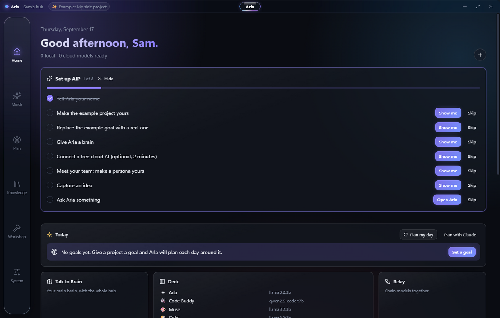
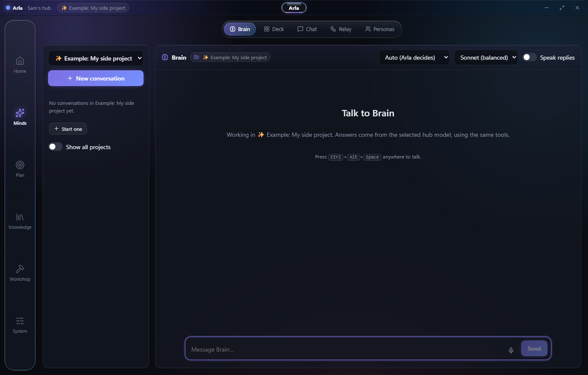
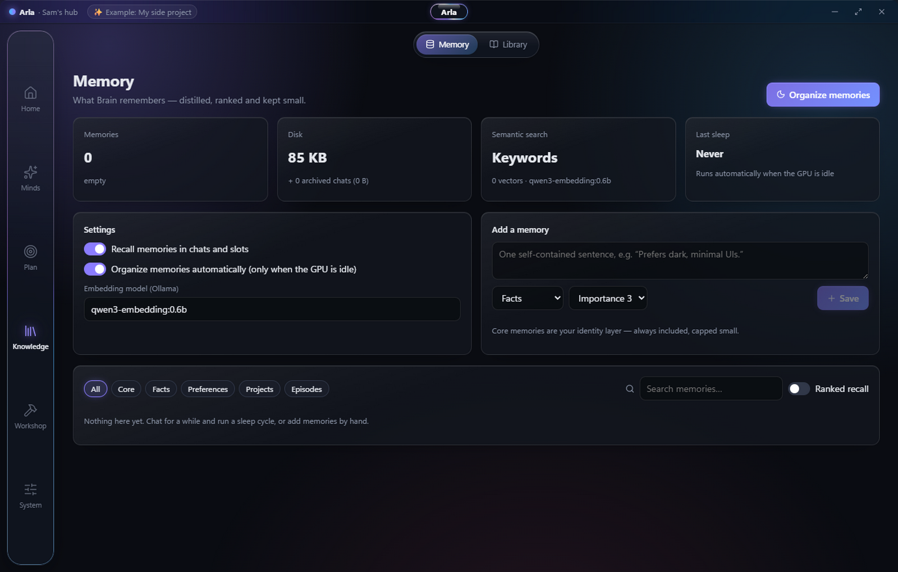

# Arla

**One place for all your AI.** It runs on your own computer, works from your phone, and learns how you work.

---

## Why Arla

Arla is a personal AI hub for your own computer and phone that turns a pile of disconnected AI
models and chat windows into one assistant with a memory. She sits in front of everything you
have — small models on your machine, free cloud services, paid accounts — scores each request
for how much thinking it really needs and what it costs to get wrong, and hands it to the
smallest mind that can do it well, bringing in a team of specialists only when the work earns it.

Around that sits the part chat apps never give you: one continuous conversation that remembers
you across projects and devices, a library of your own documents and imported chat history she
can search, goals and deadlines she paces to how you actually work and updates from real evidence
of your progress, and the ability to act — change settings, arrange your screen, file your inbox,
run terminals, schedule work, and wake or sleep the machine.

She is private by default, cheap by design (most work never leaves your hardware), and built to
get better: she learns which requests need more care, writes herself small pre-checked skills so
common jobs come out right the first time, and keeps her own memory tidy.

> The promise is simple: less money spent, less time lost, less attention wasted, and less of
> your potential sitting unused in tools that forget you between sessions.

## Screenshots

<table>
<tr>
<td width="33%"> Home — today's plan, goals and your models at a glance</td>
<td width="33%"> Brain — one conversation, routed to the right model automatically</td>
<td width="33%"> Memory — distilled, ranked, and kept small</td>
</tr>
</table>

## Download

**Windows:** get the latest `Arla-Setup-*.exe` from [Releases](../../releases/latest).

Windows may warn that the installer is from an unknown publisher, because it isn't signed with a
paid certificate yet. Choose **More info → Run anyway** if you're happy to continue.

**Android:** coming to the Play Store. Until then, install the `.apk` from
[Releases](../../releases/latest).

## What it does

**Talks like an assistant, acts like one too.**
Say what you want, plainly — "switch to light mode," "add a goal to read 12 books this year," "what should I focus on today?" — and Arla does it: changes settings, opens pages, rearranges Home, edits projects and personas, files your Inbox, opens a terminal, or puts the machine to sleep on a schedule. She isn't a chatbot that talks about doing things.

**Keeps up when you talk over her.**
Most chat apps make you wait for the reply before you can say anything else. Add a correction mid-reply and it folds straight into what she's already working on; ask something unrelated and it queues instead of getting lost; a quick aside gets answered instantly by a local model while the bigger job keeps running.

**The right mind for every job, automatically.**
Every message is scored for how much thinking it needs and what it costs to get wrong, then handed to the smallest model that can do it well — a fast local model for a command, a stronger one for judgment, a team of specialists only when a job actually earns it. You stop paying frontier-model prices to be told the time.

**A Timeline that won't let you lie to yourself.**
Set a deadline and Arla paces the remaining milestones to it and to how you actually work. A milestone is only marked done on real evidence — a passing check, a git commit, a finished task — never because it was told to. When a deadline slips, she re-plans and says so.

**Remembers, searches, and tidies itself.**
Memory keeps a small, ranked picture of what matters and reorganizes itself on its own rather than growing into a junk drawer. A Library of your own notes, PDFs and code is searchable by every model in the hub. Drop in a ChatGPT, Claude, Gemini or Copilot export and she files it and remembers what mattered.

**Writes her own playbook.**
When Arla learns a job well enough, she writes herself a small, pre-checked skill for it — and it has to pass its own tests before she'll save it. Common requests get faster and more reliable the longer you use her, with nothing for you to do.

**With you on your phone, too.**
Pair an Android phone to the same hub over your own network for the same projects, goals and Inbox in your pocket, with a cloud or on-device model standing in when the computer's out of reach.

**Private by default.**
No account, no servers of ours, no tracking. Most work never leaves your machine, and nothing goes to the cloud unless you connect a service yourself.

## Requirements

- Windows 10 or 11.
- If you don't have it already: [Ollama](https://ollama.com) (free - models on your pc). Without it, Arla can still use free cloud services you connect.
- Arla sizes models to the machine it finds.

## Roadmap to 1.0

Arla is in active, daily development. What's left before a 1.0 release: a signed installer,
a public store listing with the assets above, a clean-machine install pass, and crash/error
reporting wired end to end. Nothing here is a promise of a date — it's what's actually left.

## Privacy and terms

- [Privacy policy](https://irishwarhound.github.io/arla/privacy.html)
- [Terms of service](https://irishwarhound.github.io/arla/terms.html)

## Support

irishwarhoundgaming@gmail.com

---

© 2026 IrishwarhoundGaming. Arla is proprietary software; this repository holds its public downloads, documents and issue tracker, not its source code.
