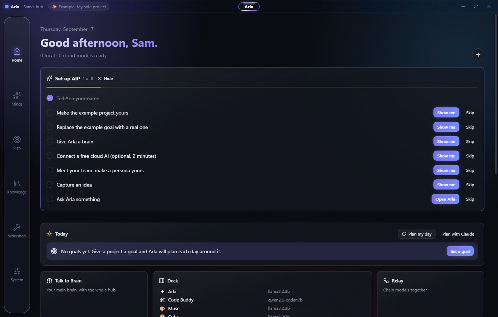
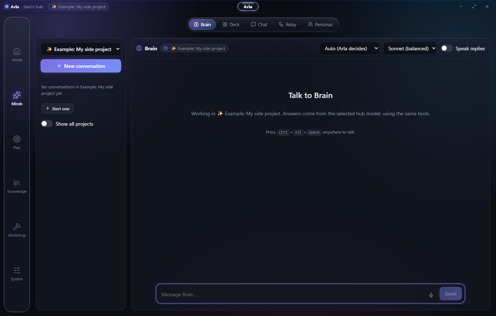
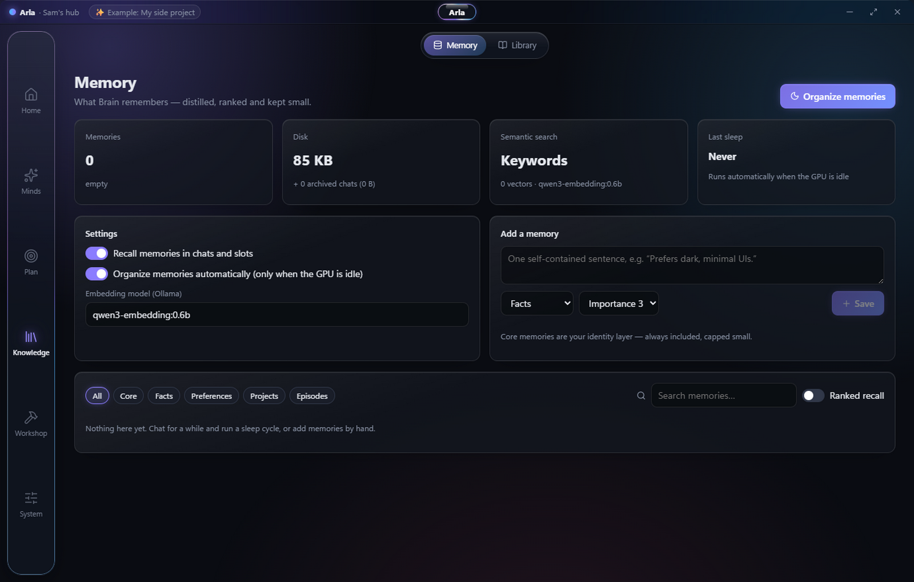

# Arla

**One place for all your AI.** It runs on your own computer, works from your phone, and learns how you work.

---

## Why Arla

Arla is a personal AI hub for your own computer and phone that turns a pile of disconnected AI
models and chat windows into one assistant with a memory. She sits in front of everything you
have — small models on your machine, free cloud services, paid accounts — scores each request
for how much thinking it really needs and what it costs to get wrong, and hands it to the
smallest mind that can do it well, bringing in a team of specialists only when the work earns it.

Around that sits the part chat apps never give you: one continuous conversation that remembers
you across projects and devices, a library of your own documents and imported chat history she
can search, goals and deadlines she paces to how you actually work and updates from real evidence
of your progress, and the ability to act — change settings, arrange your screen, file your inbox,
run terminals, schedule work, and wake or sleep the machine.

She is private by default, cheap by design (most work never leaves your hardware), and built to
get better: she learns which requests need more care, writes herself small pre-checked skills so
common jobs come out right the first time, and keeps her own memory tidy.

> The promise is simple: less money spent, less time lost, less attention wasted, and less of
> your potential sitting unused in tools that forget you between sessions.

## What's new since 0.1.0

Arla has been in daily development since the 0.1.0 preview. These changes are finished and in
testing; they arrive with the 1.0 release.

- **One conversation everywhere.** The same conversation continues on your computer and your
  phone, including what you say to the phone while the computer is off. Arla notes which model
  answered and falls back to another one if a reply fails.
- **She does the work, and you can take it back.** Changes Arla makes to your goals, tasks, plans,
  checks and notes are saved together as one step you can undo. A large batch waits on a review
  card for your OK, and a check that runs a command on your computer is always shown to you first.
- **She asks before she guesses.** When you ask for a new task, goal, plan or check, Arla makes
  sure she has what it needs (what it is, why it matters, its steps, or how to tell a check has
  passed) and asks for anything missing in one short question. She also notes who it's for:
  something she can do herself, or something only you can do.
- **Action items you can manage in place.** Task, goal, plan and check cards have a Start button,
  a two-press delete with Undo, and editing, even after an item is finished. A finished plan keeps
  its results and can be run again as a fresh copy. New items start with sensible dates.
- **Test Arla.** One button runs a short, self-contained check of the assistant with your own
  models and reports what worked.
- **Cloud models your way.** Add keys for the services you use, see the models each key can
  reach, and set usage budgets so nothing runs away.
- **Personas with a full character sheet**, a movable orb that opens Arla from anywhere on
  screen (even outside the app), sticky notes on desktop and phone, a Research page that keeps
  sources with trust labels, and an Image Studio for generating and finding pictures.
- **A safer phone link.** The Android app's connection to your computer is now encrypted, and
  the phone reconnects on its own when you come back to it.
- **Looking after your data.** Manual, nightly and before-update backups on the desktop, and a
  phone backup you can save to your computer.

## Screenshots

<table>
<tr>
<td width="33%"> Home — today's plan, goals and your models at a glance</td>
<td width="33%"> Brain — one conversation, routed to the right model automatically</td>
<td width="33%"> Memory — distilled, ranked, and kept small</td>
</tr>
</table>

## Availability

Arla isn't available for download yet: it's in private testing. This page will say how to get it
when it is.

## What it does

Say what you want, plainly — "switch to light mode," "add a goal to read 12 books this year,"
"what should I focus on today?" — and Arla does it: changes settings, opens pages, rearranges
Home, edits projects and personas, files your Inbox, opens a terminal, or puts the machine to
sleep on a schedule. She isn't a chatbot that talks about doing things. And unlike most chat apps,
you don't have to wait for her to finish before you say anything else: a correction mid-reply
folds into what she's already working on, something unrelated queues instead of getting lost, and
a quick aside gets answered instantly by a local model while the bigger job keeps running.

Under the hood, the app is organized the way you'd actually use it:

### Minds — every way to talk to a model

- **Brain** is the main hub-wide assistant. Leave routing on **Auto** and Arla picks the model
  herself, or pin a specific one for a conversation. This is where she acts on the app itself.
- **Personas** give you focused characters instead of one generic voice — **Code Buddy**,
  **Muse**, **Critic**, **Scout** and more ship by default, each with its own temperature and
  system prompt, and you can make your own with a full icon picker and goals of their own.
- **Deck** runs several chat slots side by side — different models or personas answering the
  same thing at once, so you can compare instead of guessing which one to trust.
- **Chat** is a plain, single-thread conversation with a model of your choosing.
- **Relay** chains models into a pipeline: each step receives `{{input}}` (your prompt) and
  `{{prev}}` (the previous step's output) — draft with one model, critique with another, polish
  with a third, all in one run.

### Plan — where the work actually gets tracked

- **Inbox** is capture-now-sort-later: drop in an idea, link or to-do and Arla files it.
- **Timeline** paces your remaining milestones to a deadline and to how you actually work.
- **Projects & Goals** organizes work into projects, each with its own goals and milestones —
  a milestone is only marked done on real evidence (a passing check, a git commit, a finished
  task), never because it was told to, and Arla re-plans and says so when a deadline slips.
- **Work log** is a running record of what's next, in progress, and done.
- **Routines** are jobs Arla runs on a schedule without you asking each time.

### Knowledge — memory and your own documents

- **Memory** keeps a small, ranked picture of what matters and reorganizes itself on its own
  (on a sleep cycle, when the GPU is idle) instead of growing into a junk drawer you have to prune.
- **Library** indexes your own notes, PDFs and code so every model in the hub can search it —
  and it's where a dropped-in ChatGPT, Claude, Gemini or Copilot export ends up, filed and
  remembered.

### Workshop — how Arla stays capable, and how you stay in control

- **Tools** connects external MCP servers so Arla can use other tools you run — start and stop
  each one, and approve what it's allowed to touch.
- **Models** manages what's installed locally through Ollama and what cloud providers are
  connected, with a live read on what's actually available right now.
- **Skills** are small, pre-checked playbooks Arla writes herself as she learns a job — each one
  has to pass its own tests before she'll save it, so common requests get faster and more
  reliable the longer you use her.
- **Specialists** is the bench she can pull from for a job big enough to earn a team, instead of
  one model trying to do everything.
- **Checks** are the same build, syntax and page-smoke checks that gate a real release — visible
  and re-runnable by you at any time, not hidden in a CI log somewhere.

### Bring your own model

Arla works fully offline with [Ollama](https://ollama.com), or you can connect any OpenAI- or
Anthropic-compatible endpoint — OpenRouter, Groq, LM Studio, OpenAI, Anthropic directly, or your
own self-hosted server — and mix them freely. A usage meter tracks what you're spending on
metered providers so nothing shows up as a surprise.

### Make it yours

Five themes — glass, midnight, aurora, sunset, daylight — and a Home built from panels you
choose (goals, recent chats, loaded models, usage, personas) instead of one fixed layout.

### With you on your phone, too

Pair an Android phone to the same hub over your own network for the same projects, goals and
Inbox in your pocket, with a cloud or on-device model standing in when the computer's out of reach.

### Private by default

No account, no servers of ours, no tracking. Most work never leaves your machine, and nothing
goes to the cloud unless you connect a service yourself.

## Requirements

- Windows 10 or 11.
- If you don't have it already: [Ollama](https://ollama.com) (free - models on your pc). Without it, Arla can still use free cloud services you connect.
- Arla sizes models to the machine it finds.

## Roadmap to 1.0

Arla is in active, daily development. Planned next, before 1.0:

- **A life cycle for action items:** Not started, Needs your input, Running, In progress and Done,
  with Start doing the right thing for who the item is for, and items that repeat daily, weekly
  or monthly while keeping their history.
- **Today, Week, Month and Year views** on the Today panel, and a day schedule that respects your
  own hours: work stays in work time and personal time stays yours.
- **Timeline bars** that show how long a goal or plan runs, from its start to its next checkpoint.
- Then the release checklist: a clean-machine install pass and the store listing.

Nothing here is a promise of a date — it's what's actually left.

## Privacy and terms

- [Privacy policy](https://irishwarhound.github.io/arla/privacy.html)
- [Terms of service](https://irishwarhound.github.io/arla/terms.html)

## Support

irishwarhoundgaming@gmail.com

---

© 2026 IrishwarhoundGaming. Arla is proprietary software; this repository holds its public documents and issue tracker, not its source code or downloads.
